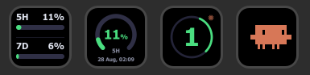

# Claude Agent Status for Stream Deck

<div align="center">
  
  <br>
  <em>Usage Limits · Usage (one window) · Agent Count · Clawd</em>
</div>

A Stream Deck plugin for keeping an eye on Claude Code. Four keys:

| Key | Shows |
| --- | --- |
| **Agent Count** | A live count of your running agents, on a ring that spins while they work and turns amber when one is waiting on you |
| **Clawd** | The same thing, as Claude Code's own mascot, wiggling along — and throwing confetti each time an agent finishes |
| **Usage Limits** | How much of your 5-hour and weekly Claude limits is spent, as two bars |
| **Usage (one window)** | One of those limits, large, with the time it resets |

The two usage keys read the same unofficial endpoint the `claude` CLI uses for
its own `/usage`, with the login it already has. Nothing to paste, nothing
stored — and nothing guaranteed: that endpoint is not a public API and can
change without notice.

## Supported

| Host | Status |
| --- | --- |
| WSL (Claude Code on Windows, via WSL) | ✅ Supported |
| Windows (Claude Code installed natively, no WSL) | ✅ Supported — set **Where Claude runs → Host** to “This machine”; Auto still means WSL on Windows |
| Linux (Claude Code installed natively) | ❔ Not yet — Stream Deck itself has no official Linux release |
| macOS (Claude Code installed natively) | ✅ Supported |

## Install

Requires the Stream Deck app already installed and running.

Download the latest
**[com.claudify.agents.streamDeckPlugin](https://github.com/danladis/claudify-streamdeck/releases/latest)**
and double-click it — the Stream Deck app takes it from there.

Then drag any of **Claude Agents → Agent Count**, **Clawd**, **Usage Limits** or
**Usage (one window)** onto a key.

### From source

Needs Node.

```sh
npm run deps            # fetch the plugin's one runtime dependency (ws)
npm run install-plugin  # copy the plugin into Stream Deck and reload it
```

`install-plugin` reloads via Stream Deck's `streamdeck://` deep links, which
need developer mode:

```sh
npm run dev-mode        # once; --off to undo
```

Without developer mode the copy still lands, but Stream Deck needs a quit and
reopen to pick it up.

## Configuring

Everything is a per-key setting in the Property Inspector (click the key in
Stream Deck), and the defaults work if Claude Code is installed the usual way.

The agent keys take a refresh interval, what counts as an agent, which face and
animation, what a press does, and how to reach Claude Code.

That last one is **Where Claude runs → Host**, and **Auto** means WSL on Windows
— which is right for most people there, and stays the default so nobody's key
changes hosts under them. If your Claude Code is installed on Windows itself,
pick **This machine**: the plugin then runs `claude agents --json` directly
instead of through `wsl.exe`, and a press opens Windows Terminal (or falls back
to `cmd`) rather than a distro shell. A **custom command** is run by whichever
host is selected, so it is a POSIX shell line under WSL and a `cmd` line on
native Windows — the same key does not mean the same thing on both.

When an agent finishes its work, Clawd blows a party horn and rains confetti for
two and a half seconds, then goes back to whatever the key was showing. He hops
at the key's own **Speed**, but the burst is the same length at every setting —
the key has a real state to get back to. Finishing means a session that was busy and has
stopped being busy, or a background job whose state file says it concluded
successfully — an agent that stops to *wait on you* is not finished, and neither
is one that failed. Turn it off with **Celebrate when an agent finishes**. A key
set not to animate marks the moment with a single still frame instead.

By default the Agent Count key shows every open session. Set **Show** to **Only
running** and the number drops the idle ones, leaving just the agents at work or
waiting on you — the colours are unchanged, so a lone blocked agent is still
amber.

The usage keys take a refresh interval, the percentages the colours change at,
which window and reset format the single-window key shows, and — under
**Where the credentials are** — an override if your credentials file is
somewhere unusual. Leave that blank: the login is read from
`~/.claude/.credentials.json`, or from the login Keychain on macOS, where Claude
Code writes no file. Naming a path there turns the Keychain lookup off.

If the path you name is inside WSL (`\\wsl.localhost\…`), the key checks that
WSL is already running before it opens the file — reading it otherwise would
start the distro. A timed refresh that finds WSL stopped keeps the last numbers
on the key and greys it out, so you can see the reading is no longer being
confirmed; pressing the key, or the panel's **Refresh**, reads it regardless.
This is the same restraint the agent keys show when they probe through WSL.

Every key can be **transparent**, **blue** or **gray**; transparent is the
default and lets the key show Stream Deck's own black.

### Polling and rate limits

The usage endpoint throttles hard — roughly five requests per five minutes,
then a 429 with a long `Retry-After` — so a minute is the floor on the refresh
interval, and every usage key on the deck shares one reading. When a refresh
does fail, the key keeps showing the last good numbers, greyed out, rather than
blanking. An expired login greys the key the same way — the Property Inspector
says which it is. Only a refused or broken request takes the key over with a
message.

## Development

```sh
npm test                # unit tests
npm run simulate        # run the plugin against a fake Stream Deck
npm run preview         # render every key state to build/preview/index.html
npm run validate        # Elgato's manifest linter
npm run pack            # build a .streamDeckPlugin file
```

### Releasing

```sh
npm run bump -- 1.1.0   # set the version in package.json and manifest.json
git commit -am "release: v1.1.0" && git tag v1.1.0 && git push --follow-tags
```

Pushing a `v*` tag runs [`.github/workflows/release.yml`](.github/workflows/release.yml),
which tests, validates and packs the plugin, then publishes a GitHub release with
the `.streamDeckPlugin` attached. The tag has to match the version in the
manifest, or the workflow stops.

## Credits

The usage keys are a port of
[stream-deck-ai-limits](https://github.com/Sing3Rous/stream-deck-ai-limits) by
David Utyuganov, used under the MIT licence, with a macOS Keychain fix from two
unmerged pull requests against it and some additional coloring options. See [THIRD-PARTY-NOTICES.md](THIRD-PARTY-NOTICES.md).
